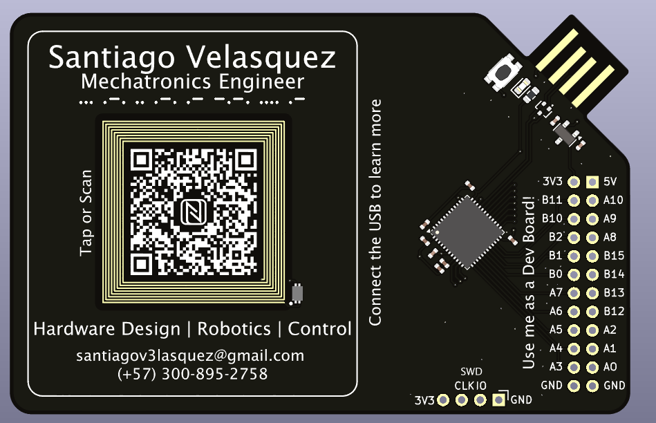
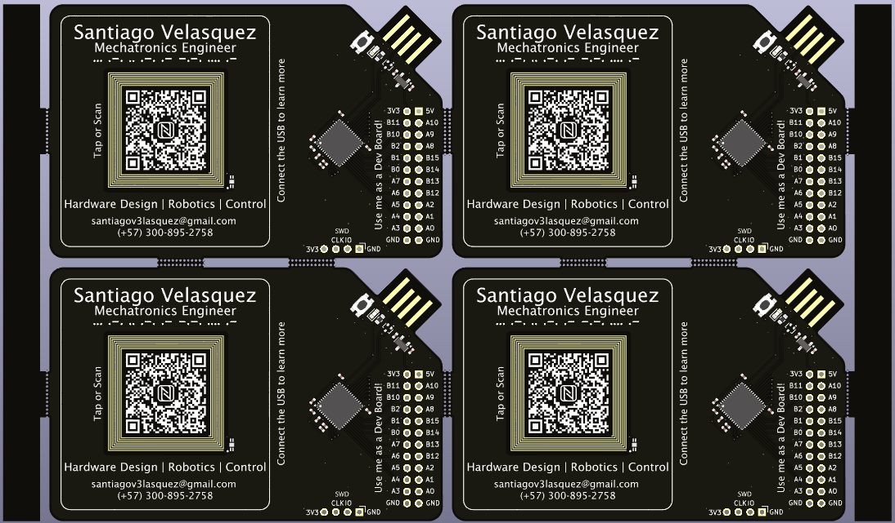
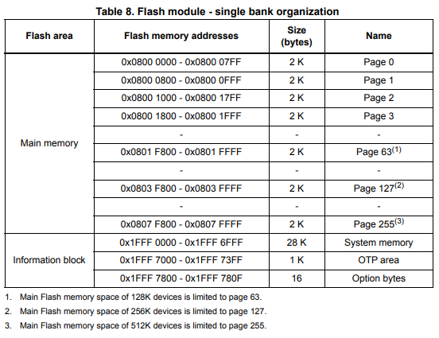
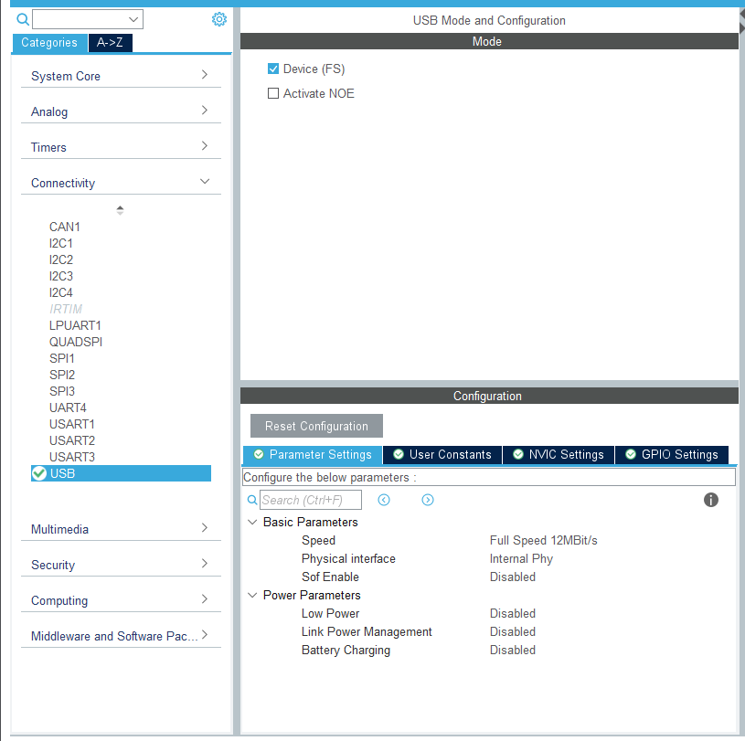
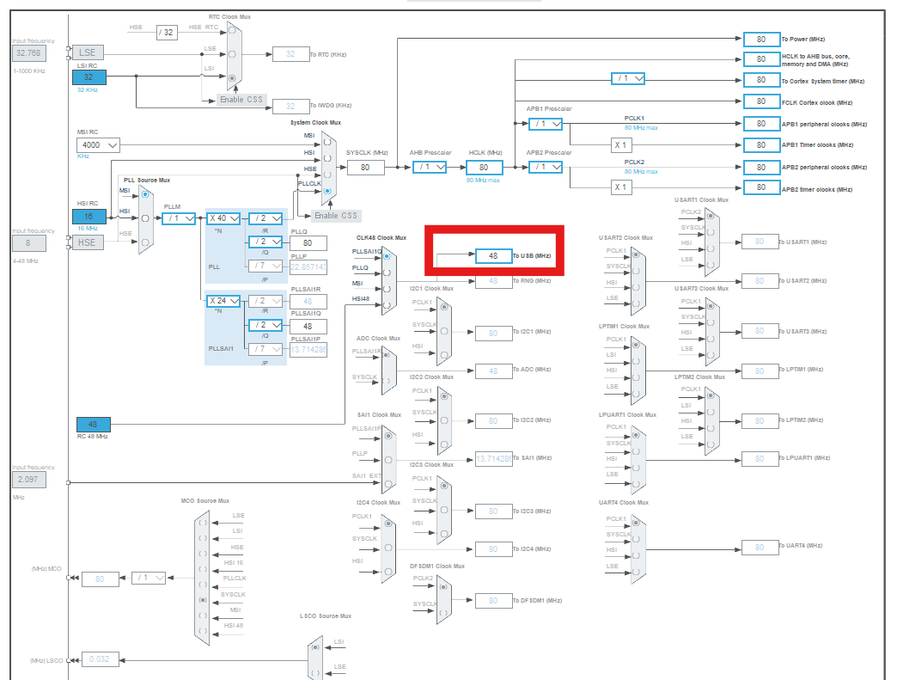

# PCB Business Card

The **PCB Business Card** is a hardware project inspired by the [Hackaday 2024 Business Card Contest](https://hackaday.io/contest/195949-2024-business-card-contest)   and the business cards created by [Salvaged Circuitry](https://www.youtube.com/watch?v=rEdWV4Augfc).

It is a compact and creative way to showcase your capabilities as a hardware designer while sharing your contact details. Beyond being a novelty, the card also functions as a (slightly impractical, but fun) development platform.



---

## Board Design

The PCB was designed using **KiCad**, along with plugins such as **KiKit** and the **Fabrication Toolkit** to generate production-ready files.

The board features:

- **[STM32L452CEU](Datasheets\stm32l452ce.pdf)** microcontroller  
- **[NT2H1311F0DTLH](Datasheets\NTAG213F_216F.pdf)** NFC tag  
- Integrated **PCB USB connector**  
- Optional **pin headers**, allowing the card to be used as a development board  

The USB connector supplies power to the microcontroller through a **[3.3 V LDO regulator](Datasheets\LM3480.pdf)** and includes ESD protection on the data lines using a **TVS diode**. A power LED is placed next to the connector for visual feedback.

The NFC tag is connected to a custom PCB antenna designed using NXP’s [NFC Antenna Design Tool](https://community.nxp.com/t5/NFC/bd-p/nfc).  
This tool provides a convenient interface to design PCB NFC antennas (especially for NXP tags/readers) based on user-defined constraints. ST also provides a similar [antenna design tool](https://eds.st.com/antenna/#/).

---

### Bill of Materials (BOM)

| Reference | Value | Footprint | Quantity |
|---------|------|-----------|----------|
| C1–C4, C7–C9 | 100 nF | 0402 | 7 |
| C5 | 10 nF | 0402 | 1 |
| C6 | 1 µF | 0402 | 1 |
| D1 | RCLAMP0582B | SOT-416 | 1 |
| D2 | LED | 0603 | 1 |
| IC1 | NT2H1311F0DTL | SOT1312AB2 | 1 |
| R1 | 120 Ω | 0603 | 1 |
| SW1 | SMD push button | 4.6×1.8×1.9 mm | 1 |
| U1 | STM32L452CEU | QFN-48 | 1 |
| U2 | LM3480-3.3 | SOT-23 | 1 |

> **Note**  
> Reference designators were removed from the PCB layout to improve the visual appearance of the board.

---

## Fabrication

For fabrication, **KiCad’s KiKit** and **JLCPCB’s Fabrication Toolkit** plugins were used.

### Panelization

KiKit was used to panelize the PCB. Each panel contains **four PCB business cards**, separated by mouse bites and surrounded by left and right rails.

The panel configuration file can be found here:  
`PCBussinesCard_Circuit/Panels/panel_config.json`

For more information on KiKit panelization, refer to the official documentation:  
https://yaqwsx.github.io/KiKit/latest/panelization/examples/



### Manufacturing

Manufacturing was done using **JLCPCB**, with production files generated via the JLCPCB Fabrication Toolkit plugin.

---

## Software

The USB connector is used to expose the board as a **USB Mass Storage Device**, allowing a host computer to read and write files (for example, a digital CV) directly to the microcontroller’s internal flash memory.

This implementation uses the STM32’s built-in **USB Full-Speed device** support and the **Mass Storage Class (MSC)**.

The implementation was based on and adapted from the following guide:  
[STM32 USB MSC using Flash Memory – Embetronicx](https://embetronicx.com/tutorials/microcontrollers/stm32/stm32-usb-device-msc-using-flash-memory/)

---

### Flash Memory Configuration

According to the [RM0394 Reference Manual](Datasheets/rm0394-stm32l41xxx42xxx43xxx44xxx45xxx46xxx-advanced-armbased-32bit-mcus-stmicroelectronics.pdf), the STM32L452 has **512 KB of flash memory** organized in a single bank.



In this project:
- **64 KB** of flash is reserved for USB mass storage
- Starting at **Page 127**
- Flash start address:  
  **`0x0803F800`**

---

## STM32CubeIDE Configuration

1. Create a new STM32CubeIDE project for the **STM32L452**.
2. Under **Connectivity**, enable **USB Device (FS)**.
3. In **Middleware and Software Packs → USB_DEVICE**:
   - Set the class to **Mass Storage Class**
   - Set `MSC_MEDIA_PACKET` to **32 KB (32768 bytes)**




4. Ensure the USB clock is configured at **48 MHz** in the clock configuration tab.



5. Generate the project code.

---

## USB Mass Storage Implementation

Open the file: ```usb_device/App/usbd_storage_if.c```


### Storage Parameters

```c
#define STORAGE_LUN_NBR    1
#define STORAGE_BLK_NBR    128      // 128 blocks × 512 bytes = 64 KB
#define STORAGE_BLK_SIZ    0x200    // 512 bytes
```
---
### Flash Write Function
A helper function is added to write data to flash memory:

```c
#include <stdbool.h>

#define USB_FLASH_START_ADDRESS   (  0x0803F800 )    //USB Flash Address (page 127 in STM32L452)
#define TOTAL_USB_DEVICE_SIZE   ( STORAGE_BLK_NBR * STORAGE_BLK_SIZ )

/**
  * @brief  Writes data into the FLASH.
  * @param  buf: data buffer.
  * @param  blk_addr: Logical block address.
  * @param  blk_len: Blocks number.
  * @retval HAL_StatusTypeDef
  */
static HAL_StatusTypeDef write_data_to_flash( uint8_t *buf, uint32_t blk_addr, uint16_t blk_len )
{
  HAL_StatusTypeDef ret = HAL_OK;
  uint8_t           data[ TOTAL_USB_DEVICE_SIZE ];

  do
  {
    /* First copy the data to the local buffer from Flash */
    memcpy( data, (const void *)USB_FLASH_START_ADDRESS, TOTAL_USB_DEVICE_SIZE );
    
    /* Make modifications in the local buffer */
    memcpy((void*)&data[blk_addr*STORAGE_BLK_SIZ], buf, (blk_len*STORAGE_BLK_SIZ));
    
    ret = HAL_FLASH_Unlock();
    if( ret != HAL_OK )
    {
      break;
    }
    
    /* Erase the Flash */
    FLASH_EraseInitTypeDef EraseInitStruct;
    uint32_t SectorError;
    EraseInitStruct.TypeErase     = FLASH_TYPEERASE_SECTORS;
    EraseInitStruct.Sector        = FLASH_SECTOR_6;
    EraseInitStruct.NbSectors     = 1;                    //erase 1 sector(6)
    EraseInitStruct.VoltageRange  = FLASH_VOLTAGE_RANGE_3;
    
    ret = HAL_FLASHEx_Erase( &EraseInitStruct, &SectorError );
    
    /* Write the data to the Flash */
    for( uint32_t i = 0; i < TOTAL_USB_DEVICE_SIZE; i++)
    {
      ret = HAL_FLASH_Program( FLASH_TYPEPROGRAM_BYTE,
                  ( USB_FLASH_START_ADDRESS + i ),
                  data[i]
                  );
    
      if( ret != HAL_OK )
      {
        break;
      }
    }
    
    HAL_FLASH_Lock();
  } while( false );

  return( ret );
}
```
The function:

1. Copies existing flash contents to a RAM buffer

2. Modifies the buffer with new data

3. Erases the corresponding flash sector

4. Writes the updated data back to flash

---
### Write Callback
```c
int8_t STORAGE_Write_FS(uint8_t lun, uint8_t *buf, uint32_t blk_addr, uint16_t blk_len)
{
  UNUSED(lun);
  return write_data_to_flash(buf, blk_addr, blk_len);
}

```
---
### Read Callback
Reading data is simpler and can be done directly from flash:

```c
int8_t STORAGE_Read_FS(uint8_t lun, uint8_t *buf, uint32_t blk_addr, uint16_t blk_len)
{
  UNUSED(lun);
  memcpy(
    buf,
    (const void *)(USB_FLASH_START_ADDRESS + (blk_addr * STORAGE_BLK_SIZ)),
    blk_len * STORAGE_BLK_SIZ
  );
  return USBD_OK;
}

```
---
### Usage
1. Flash the firmware to the board.

2. Connect the PCB Business Card via USB.

3. A removable USB drive will appear.

4. Format the drive if prompted.

5. Files can now be read from and written to the device.
